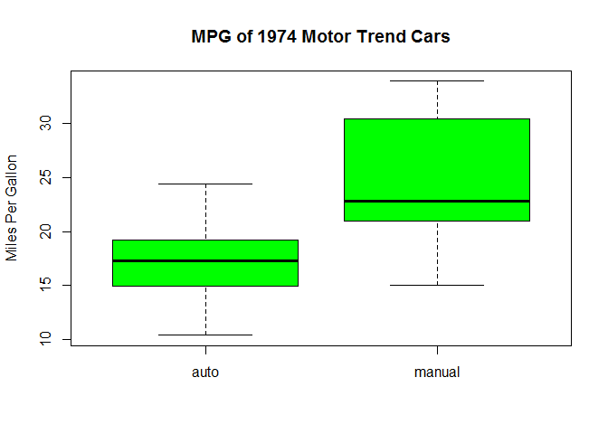
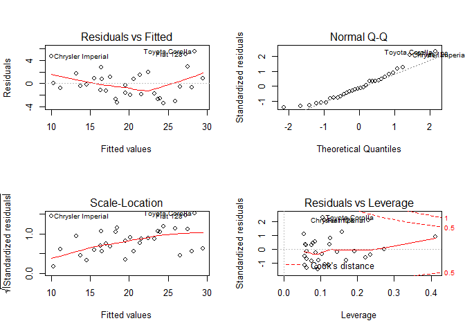

# Analysis of Transmission Types to Fuel Efficiency
Qingcheng  
Wensday, August 27, 2014  


## Executive Summary
Fuel consumption always to be one of major considerations when purchasing a new vehicle. In this report, we will exploring the [Motor Trend Car Road Tests][1] datasets in R to analyze the influence of some factors to fuel efficiency, especially the influence of transmission types(automatic vs manual) on miles per gallon(MPG).


## Model Selection

First, we load the data from R package dataset, and convert variables transmission types(am) and number of cylinders(cyl) to factors. Then give T test of mpg for two transmission types.


```r
data(mtcars)
mtcars$cyl <- factor(mtcars$cyl)
mtcars$am <- factor(mtcars$am, levels=c(0,1), labels=c('auto', 'manual'))
t.test(mtcars$mpg[mtcars$am=='auto'],mtcars$mpg[mtcars$am=='manual'])
```

```
## 
## 	Welch Two Sample t-test
## 
## data:  mtcars$mpg[mtcars$am == "auto"] and mtcars$mpg[mtcars$am == "manual"]
## t = -3.767, df = 18.33, p-value = 0.001374
## alternative hypothesis: true difference in means is not equal to 0
## 95 percent confidence interval:
##  -11.28  -3.21
## sample estimates:
## mean of x mean of y 
##     17.15     24.39
```

Then we know that MGP appears to be higher for manual transmission. And p-value less than 0.05.


Then we compare two linear model to see the influence of factors on miles per gallon.


```r
model1 <- lm(mpg ~ am, data = mtcars)
model2 <- lm(mpg ~ am + hp + wt, data = mtcars)
summary(model1)$coefficients
```

```
##             Estimate Std. Error t value  Pr(>|t|)
## (Intercept)   17.147      1.125  15.247 1.134e-15
## ammanual       7.245      1.764   4.106 2.850e-04
```

```r
summary(model2)$coefficients
```

```
##             Estimate Std. Error t value  Pr(>|t|)
## (Intercept) 34.00288   2.642659  12.867 2.824e-13
## ammanual     2.08371   1.376420   1.514 1.413e-01
## hp          -0.03748   0.009605  -3.902 5.464e-04
## wt          -2.87858   0.904971  -3.181 3.574e-03
```

We can see that for model1, the p-value < 0.001, seems to be exist significant relationship. For model2, we add the `hp` and `wt` to be predictors, the p-value become larger.

From residual QQ plots in figure 2(see Appendix), we can know that the residuals is approximately normally distributed. 

## Appendix 

Figure 1 boxplot of `mpg` respect to `am`.  

```r
boxplot(mpg ~ am, data=mtcars, col="green",
        ylab="Miles Per Gallon", main="MPG of 1974 Motor Trend Cars")
```

 


Figure 2 Residual plots.


```r
par(mfrow = c(2, 2))
plot(model2)
```

 


[1]:http://stat.ethz.ch/R-manual/R-devel/library/datasets/html/mtcars.html
